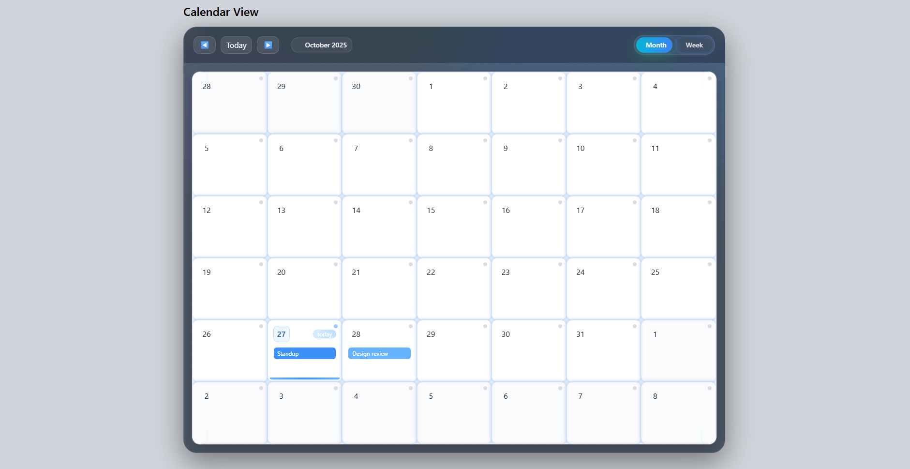

# 📅 React Calendar View (Month & Week)

This is my **Calendar View Assignment Project** built using **React, TypeScript, TailwindCSS**, and **Storybook**.  
It allows users to view events in both **Month** and **Week** modes, and supports adding, editing, and deleting events.

---

## 🖼️ Preview

Here’s how the calendar looks:



*(Screenshot of my final calendar design — responsive, clean, and fully interactive.)*

---

## 💡 Project Overview

I made this project completely from scratch without using any prebuilt calendar libraries.  
It includes all the required functionalities with a focus on **responsiveness**, **accessibility**, and **clean UI**.

### ✨ Features:
- Month and Week calendar views  
- Create / Edit / Delete events  
- Select color for each event  
- Fully responsive design (mobile, tablet, desktop)  
- Keyboard navigation and accessibility  
- Smooth hover effects and modern styling  
- Built with TypeScript (strict mode)

---

## ⚙️ Tech Stack

- **React + TypeScript**  
- **TailwindCSS**  
- **Vite** for fast build and dev setup  
- **date-fns** for date utilities  
- **Storybook** for UI previews and testing

---

## 🧭 How to Run Locally

### 1️⃣ Clone and install dependencies
```bash
git clone https://github.com/yourusername/calendar-view.git
cd calendar-view
npm install
